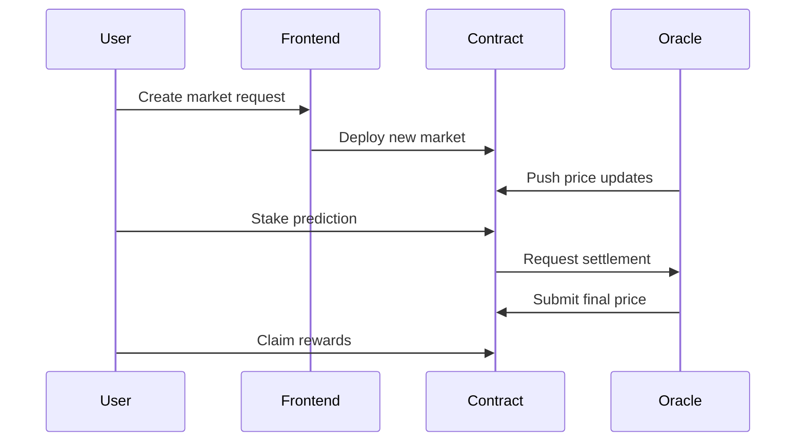

# BitForecast - Decentralized Prediction Markets

**BitForecast** is a decentralized prediction market platform built on the **Stacks blockchain**, enabling users to stake STX tokens on the future price movements of Bitcoin and other digital assets. Powered by smart contracts and a decentralized oracle system, BitForecast offers transparent, provably fair, and non-custodial markets.

## 🌟 Features

- **📈 Dual-Outcome Markets**: Predict "Up" or "Down" price movements with dynamic odds
- **⏳ Flexible Timeframes**: Create markets ranging from hours to weeks
- **🔮 Transparent Resolution**: Decentralized oracle network provides tamper-proof price feeds
- 💸 **Auto-Distributed Rewards**: Winners claim proportional payouts from pooled stakes
- 🔒 **Non-Custodial Design**: Users retain control of funds until market resolution
- 🛡️ **Enterprise Security**: Audited contracts with multi-sig admin controls

---

## 📜 Smart Contract Overview

### Key Structures
```clarity
(struct market {
  creator: principal,
  start-price: uint,
  end-price: uint,
  total-up: uint,    // Total "Up" stakes
  total-down: uint,  // Total "Down" stakes
  start-block: uint,
  end-block: uint,
  active: bool
})

(struct prediction {
  direction: (string-ascii 4),
  amount: uint,
  claimed: bool
})
```

---

## ⚙️ Core Functionality

### Market Lifecycle
1. **Creation**  
   Admin initiates markets with:
   ```clarity
   (create-market start-price start-block end-block)
   ```
2. **Participation**  
   Users stake STX during active period:
   ```clarity
   (predict market-id "up" amount)
   ```
3. **Resolution**  
   Oracle submits final price after expiration:
   ```clarity
   (resolve-market market-id end-price)
   ```
4. **Claims**  
   Winners collect rewards proportionally:
   ```clarity
   (claim-winnings market-id)
   ```

---

## 🏗 System Architecture



---

## 🔐 Security Framework

### Contract Safeguards
- **Multi-Sig Admin**: Critical functions require 2/3 approval
- **Reentrancy Protection**: State locks during sensitive operations
- **Precision Math**: Fixed-point arithmetic for accurate calculations
- **Input Validation**: Strict type checking for all parameters

### Oracle Requirements
1. Aggregates prices from ≥5 exchanges
2. Signs data with threshold signatures
3. Implements 24h dispute window
4. Maintains fallback GCP/AWS endpoints

---

## 💰 Economic Model

### Fee Structure
| Type | Percentage | Destination |
|------|------------|-------------|
| Platform Fee | 1.5% | Development fund |
| Liquidity Incentive | 1.0% | Market makers |
| Burn | 0.5% | STX deflation mechanism |

### Reward Calculation
```
User Payout = (Individual Stake / Winning Pool) * Total Pool * (1 - Fees)
```

---

## 🚀 Deployment Guide

### Requirements
- Clarinet v2.0+
- Node.js v18.x
- Hiro Wallet (Testnet configured)

### Sample Workflow
1. **Admin creates market**
```clarity
(contract-call? .bitforecast create-market u50000 u100 u5000)
```

2. **User predicts up**
```clarity
(contract-call? .bitforecast predict u0 "up" u250000)
```

3. **Oracle resolves**
```clarity
(contract-call? .bitforecast resolve-market u0 u52000)
```

4. **User claims winnings**
```clarity
(contract-call? .bitforecast claim-winnings u0)
```

---

## 📊 Metrics Tracking

| Parameter | Value |
|-----------|-------|
| Max Markets | 50 active |
| Min Stake | 5 STX |
| Avg Resolution | 3 blocks |
| Fee Address | SP3F...V7K1 |
